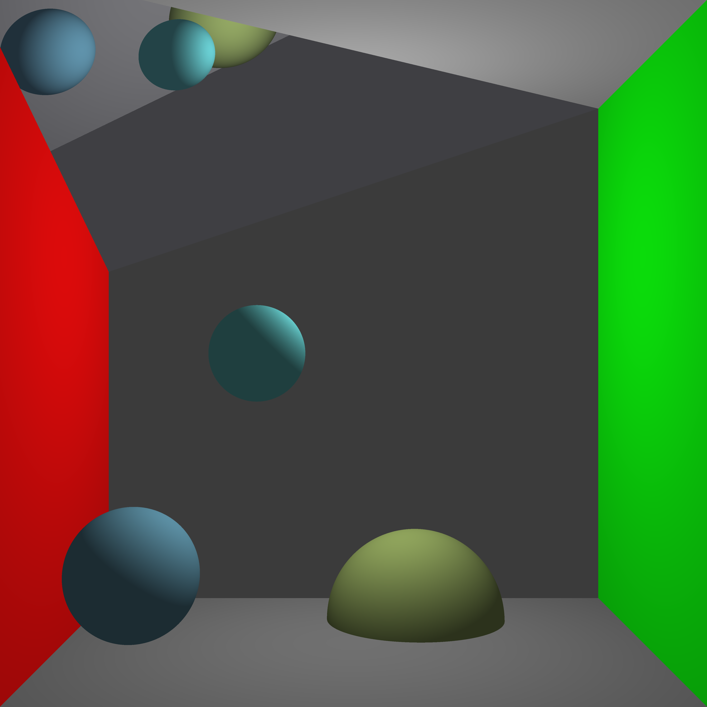

# Raytracer_rs

A simple [ray tracer][ray_wiki] written in rust.

The code for the ray tracing algorithm is found in [raytrace-lib](./raytrace-lib/).

To specify scenes the program uses a custom DSL parsed by the
module [scene_parser](./scene-parser/).
Some examples of this are found in the [scenes](./scenes/) folder.

[ray_wiki]: https://en.wikipedia.org/wiki/Ray_tracing_(graphics)

## Usage

Run an example with the parallel algorithm:

```sh
cargo build --release
./target/release/raytrace-rs -f scenes/room.scene -r 5 -o raytraced.png --parallel
```

See `raytrace-rs -h` for all available options.

## Images generated

The image generated from the example above.



## TODO

- [ ] Supersampling/Antialiasing
- [ ] More primitives
  - [ ] Cone
  - [ ] Cylinder
  - [ ] Cube
- [x] Parallelization
- [ ] Optimizations
  - [ ] Spatial Structures (grouping objects to reduce ray intersection calculations)
- [ ] [Photon mapping](https://en.wikipedia.org/wiki/Photon_mapping)
